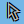

# leaflet-map-sync
Sync two or more maps with regard to center, zoom and pan.
When the cursor is over one of the maps a 'shadow cursor' is shown in the other maps.
The shape of the 'shadow cursor' is set with the `options.shadowCursor` 

Based on the great [Leaflet.Sync](https://github.com/turban/Leaflet.Sync) by [Bjorn Sandvik](https://github.com/turban/)

## Installation
### bower
`bower install https://github.com/NielsHolt/leaflet-map-sync.git --save`


## Usage
```
var mapSync = new L.MapSync( options );

mapSync.add(map);
mapSync.add(map2);
mapSync.add(map3);
```
## options

    {shadowCursor: "hand"}
possible values (default: `"hand"`):
<table>
<tr><td><code>"hand"</code></td><td></td></tr>
<tr><td><code>"crosshairs"</code></td><td></td></tr>
<tr><td><code>"cross"</code></td><td></td></tr>
<tr><td><code>"cursor"</code></td><td></td></tr>
<tr><td><code>"cursor-full"</code></td><td></td></tr>
</table>

## ToDo

New methods:
```
    MapSync.remove( map );
	MapSync.disable( map );
	MapSync.enable( map );
```

## Copyright and License
This plugin is licensed under the [MIT license](https://github.com/NielsHolt/leaflet-map-sync/LICENSE).

Copyright (c) 2015 [Niels Holt](https://github.com/NielsHolt)

## Contact information

Niels Holt <niels@steenbuchholt.dk>


## Credits and acknowledgements
[Bjorn Sandvik](https://github.com/turban/)


## Known bugs

## Troubleshooting

## Changelog


